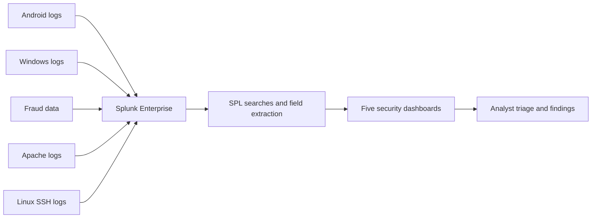
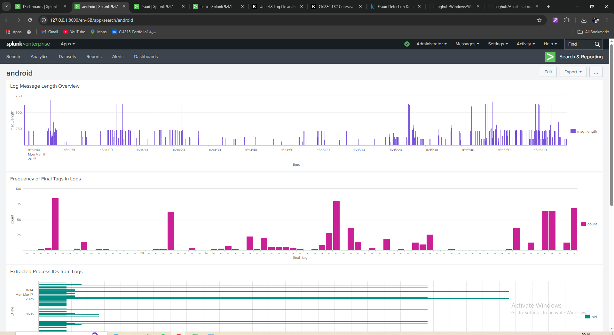
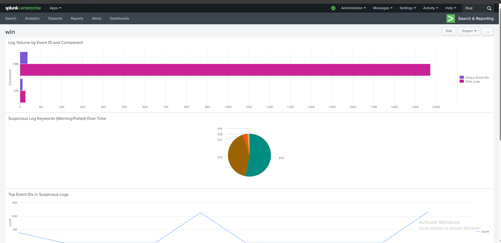
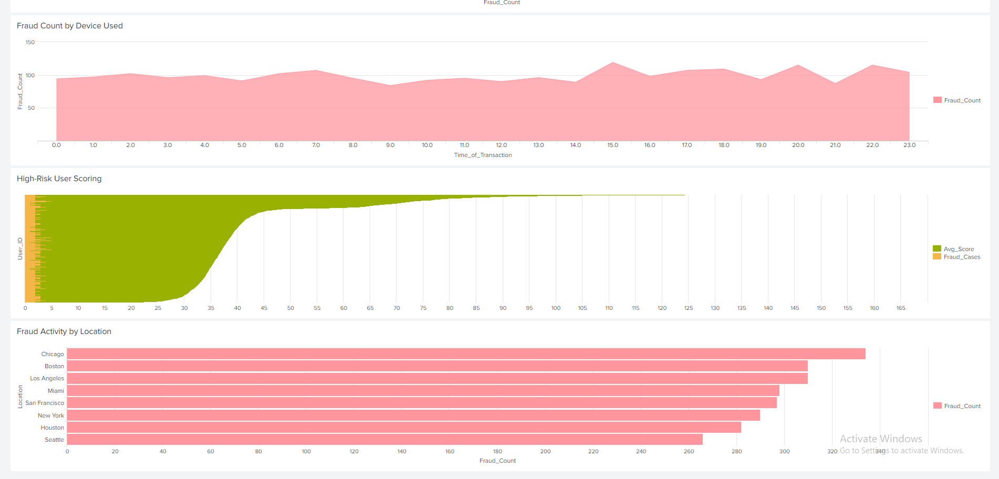
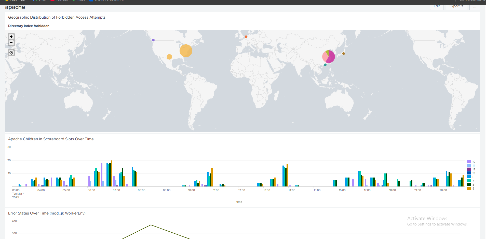
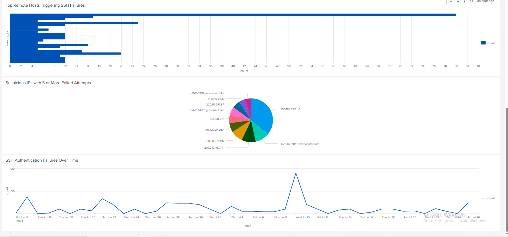

# Splunk SIEM Lab: Multi-Source Log Analysis

## Overview

This project simulates core SOC analyst work using Splunk Enterprise. I ingested five distinct datasets into separate indexes, developed 25 SPL searches, and built five dashboards to turn raw events into useful security findings.

The analysis covers Android event tagging, Windows system behaviour, financial fraud risk scoring, Apache access and error activity, and Linux SSH authentication failures.

## What this project demonstrates

- Multi-source log ingestion and index separation
- Search development with SPL
- Regex-based field extraction from unstructured events
- Dashboard design and security visualisation
- Geographic enrichment of source IP addresses
- Behaviour-based risk scoring and investigation prioritisation
- Translation of raw events into SOC-focused findings

## Architecture



## Investigation coverage

| Dataset | Index | Security focus | Standout technique |
|---|---|---|---|
| Android logs | `ezz` | Log structure and event tagging | Dynamic tag and process-ID extraction with `rex` |
| Windows logs | `win` | System behaviour and error patterns | Keyword classification using `eval` and `case()` |
| Fraud data | `inn` | Transaction anomalies and user risk | Custom behavioural risk score |
| Apache logs | `okk` | Web errors and suspicious access | Client-IP extraction and geographic enrichment |
| Linux SSH logs | `linuxx` | Failed logins and brute-force indicators | Thresholding and geographic mapping of source IPs |

## Selected detections

### Linux SSH brute-force candidates

```spl
index=linuxx sshd authentication failure
| rex field=_raw "rhost=(?<remote_ip>\d{1,3}\.\d{1,3}\.\d{1,3}\.\d{1,3})"
| stats count by remote_ip
| where count >= 5
```

This search extracts remote IP addresses, counts authentication failures, and highlights addresses that meet a simple investigation threshold.

### Fraud risk scoring

```spl
index=inn
| eval Risk_Score=(Previous_Fraudulent_Transactions * 2)
    + Number_of_Transactions_Last_24H
    + (Transaction_Amount / 100)
| stats avg(Risk_Score) as Avg_Score,
        sum(Fraudulent) as Fraud_Cases by User_ID
| where Fraud_Cases > 0
| sort -Avg_Score
```

The score combines prior fraud history, recent transaction volume, and transaction value to prioritise users for review. It is a transparent lab heuristic, not a production fraud model.

### Geographic view of Apache access failures

```spl
index=okk "Directory index forbidden"
| rex field=_raw "client (?<client_ip>\d{1,3}\.\d{1,3}\.\d{1,3}\.\d{1,3})"
| iplocation client_ip
| geostats count by Country
```

This search extracts client IPs from raw Apache events and enriches them for geographic analysis.

All 25 searches are documented in [searches/README.md](searches/README.md).

## Dashboard evidence

### Android log structure



### Windows system behaviour



### Fraud analytics



### Apache access analysis



### Linux SSH authentication



## Outcomes

The dashboards exposed several investigation patterns:

- Frequent event tags and process IDs in Android logs
- Windows warnings, failures, system errors, and event-template frequency
- Fraud cases ranked by behavioural risk indicators
- Apache error-state patterns and source-IP locations
- Repeated Linux SSH failures, targeted usernames, and likely brute-force sources

The project reinforced that dashboards support triage, but an analyst must still validate context, tune thresholds, and correlate results before treating an event as a confirmed incident.

## Limitations and next steps

- The datasets were analysed separately rather than through a shared common information model.
- Thresholds and the fraud score are lab heuristics that require validation before production use.
- Dashboard observations were not connected to a case-management workflow.
- Future work will add alerts, MITRE ATT&CK mapping, lookup-based enrichment, and cross-source correlation.

## Repository structure

```text
.
├── README.md
├── assets/
│   └── screenshots/
└── searches/
    └── README.md
```

## Safety and privacy

The repository contains sanitised screenshots and search logic only. It does not include credentials, personal records, or sensitive production data.

